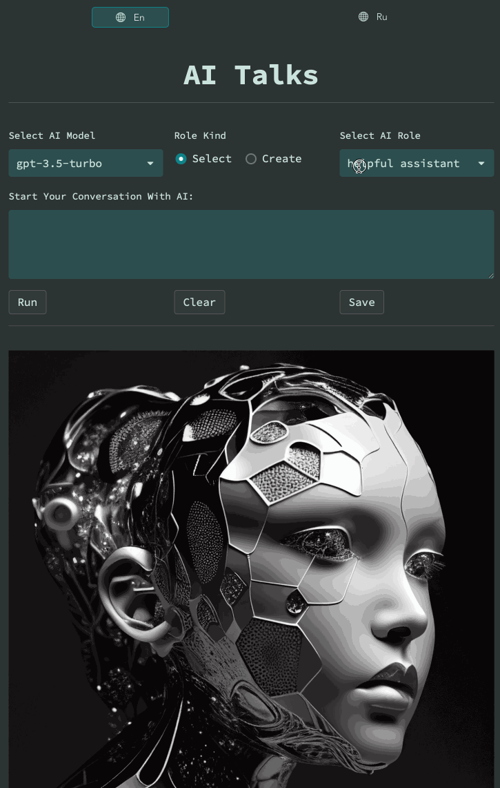
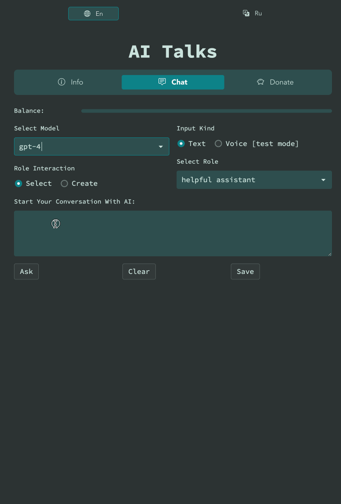

# AI Talks

[](https://ai-talks.streamlit.app)


A ChatGPT API wrapper, providing a user-friendly Streamlit web interface.

Enhance your ChatGPT experience with our user-friendly API wrapper, featuring a seamless Streamlit web interface. Effortlessly interact with ChatGPT, while enjoying an intuitive and responsive design. Discover simplified access to advanced AI technology in just a few clicks.

<details>
   <summary>Demo</summary>



<details>
   <summary>Tokens counting</summary>



</details>

</details>

## Setup

1. Clone repo:

```bash
git clone https://github.com/dKosarevsky/AI-Talks.git
```

2. Install dependencies:

```bash
pip install -r requirements.txt
```

3. Add API key to `.streamlit/secrets.toml`

```toml
[api_credentials]
api_key = "sk-..."
```

## Usage

To run the app use the following command:

```bash
bash run.sh
```

Another way:

```bash
streamlit run ai_talks/chat.py
```

Once the script is started, you can go to the URL [http://localhost:8501](http://localhost:8501) to start using the bot.

## License

This project is released under the [MIT License](LICENSE).

## Donation
<details>
   <summary>Support project</summary>

`AI Talks` collects donations solely for the purpose of paying for the `Open AI` API.
This allows you to provide access to communication with AI for all users.
Support us for joint development and interaction with the intelligence of the future!

**Crypto:**

- Bitcoin (BTC)

```
1HRDUif7oKDw9XJFXZ14TZZazokf4QH9fb
```

- USD Tether (USDT TRC20):

```
TMQ5RiyQ7bv3XjB6Wf6JbPHVrGkhBKtmfA
```

- Toncoin (TON):

```
UQDbnx17N2iOmxfQF0k55QScDMB0MHL9rsq-iGB93RMqDhIH
```

**World:**
- [Buy Me A Coffee](https://www.buymeacoffee.com/aitalks)
- [ko-fi](https://ko-fi.com/ai_talks)
- [PayPal](https://www.paypal.com/paypalme/aitalks)

**Russia:**
- [Tinkoff](https://www.tinkoff.ru/cf/4Ugsr5kQ1sR)
- [donationalerts](https://www.donationalerts.com/r/if_ai)
- [boosty](https://boosty.to/ai-talks/donate)
- [CloudTips](https://pay.cloudtips.ru/p/eafa15b2)


</details>

## Project Stats

<p align="center">
  <a href="https://star-history.com/#dKosarevsky/AI-Talks&Date">
    
  </a>
</p>
  

  
